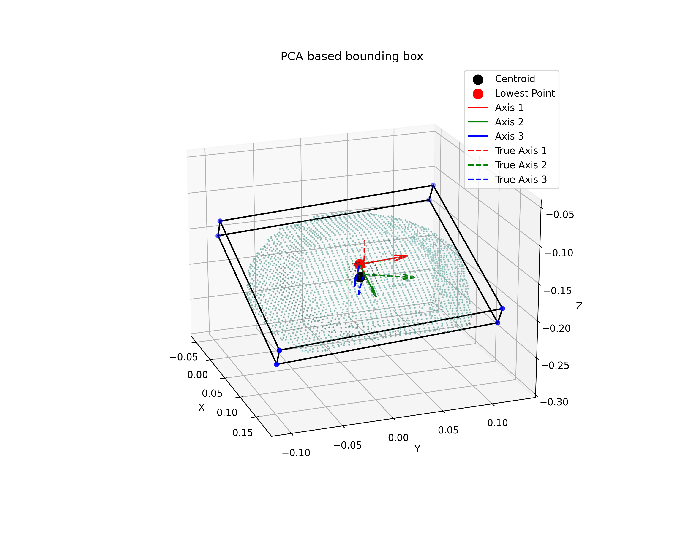
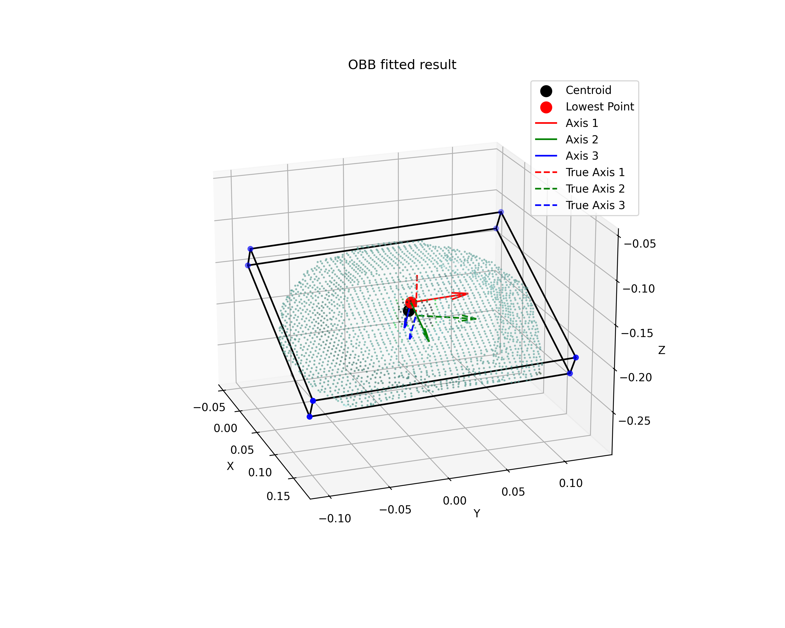
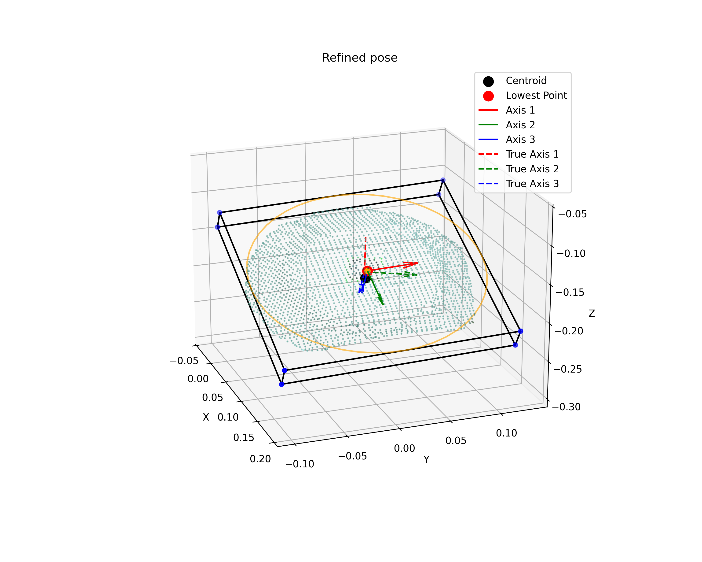
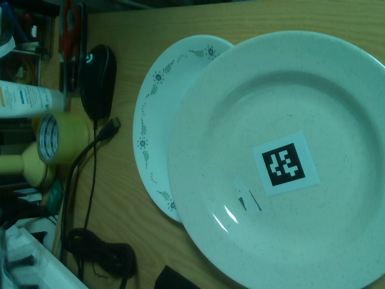
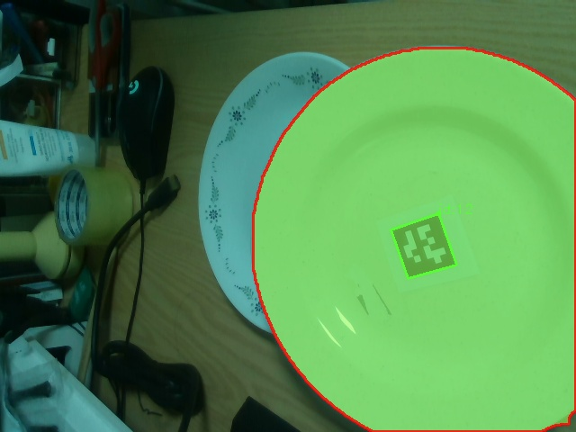

# DishPoseEstimator

Category-specific 6-DoF pose estimation for unseen dishware (plates, bowls, cups) from a single RGB-D view — built as a perception front-end for robotic grasping.

Given one RealSense capture of an unknown dish and the rough position of a robot gripper, the pipeline segments the target object, reconstructs its point cloud, and recovers a full 6-DoF pose (position + orientation) without any learned pose model or CAD reference — just geometric priors specific to dishware (flat, rotationally-symmetric objects).

## Why

General-purpose pose estimators for unseen objects (FoundationPose, SAM6D, NOCS, …) are trained to generalize across arbitrary shapes, which makes them heavy and not always accurate on any single category. Dishware is a narrow but common case for kitchen/table-clearing robots, and it has strong shape regularities (flat, axis-symmetric, thin-walled) that a lightweight geometric method can exploit directly — no training data or GPU inference required at pose-estimation time. This project trades generality for accuracy and simplicity on that one category.

## Result

Estimated pose (solid axes) converges to the AprilTag-based ground-truth pose (dashed axes) as the pipeline moves from a rough PCA estimate to the refined result:

<p align="center">
  
  
  
</p>
<p align="center"><sub><b>1. PCA-based initial estimate</b> &nbsp;→&nbsp; <b>2. Optimized oriented bounding box</b> &nbsp;→&nbsp; <b>3. Refined pose</b> (planar projection + minimum enclosing circle)</sub></p>

Translation and rotation error against the AprilTag ground truth are printed for every run (see `pose_error()` in `utils/mathfunc.py`); in informal testing on real captures, errors were on the order of a few millimeters and a few degrees. This has not yet been benchmarked over a standardized dataset — see [Limitations](#limitations--future-work).

## Pipeline

| Step | What happens | Example |
|---|---|---|
| **1. Capture** | RealSense D435 RGB-D frame, aligned and back-projected into a point cloud |  |
| **2. Segmentation** | The point cloud is cropped around the gripper's end-effector point, then [FastSAM](https://github.com/CASIA-IVA-Lab/FastSAM) segments the target object from a point prompt |  |
| **3. Cleanup** | DBSCAN clustering keeps the largest connected cluster; statistical + radius outlier removal cleans the surface | — |
| **4. (Multi-view) merging** | If multiple scenes/gripper poses are given, point clouds are registered into a common frame | — |
| **5. Pose initialization** | PCA on the point cloud gives a first estimate of the object frame; the axis of *least* variance is treated as the surface normal (flat-object heuristic), the axis of *most* variance for tall objects | see result above (1) |
| **6. OBB optimization** | Nelder-Mead search refines centroid + rotation to minimize the oriented bounding box volume | see result above (2) |
| **7. Refinement** | Points are projected onto the estimated xy-plane and fit with a minimum enclosing circle (OpenCV), giving the final center/radius/orientation — well suited to round dishware | see result above (3) |
| **8. (Optional) ground truth** | An AprilTag on the object gives a true 6-DoF pose via `solvePnP`, used for validation and visualization | dashed axes above |

## Validation

- **Real data**: RealSense captures of real plates/bowls/cups, with an AprilTag on the object as ground truth (`processing/pose_estimation.py: true_pose_from_apriltag`).
- **Synthetic data**: NVIDIA Isaac Sim scenes (`data/dataset2`) with exact ground-truth poses across several dish categories (`YCBBowl`, `CustomBowl`, `CustomCup`, `CustomDish`, `CustomSquareDish`, `SlicedBowl`), used to check the algorithm independent of sensor noise.
- Poses can be reported in the camera, gripper, or world frame (`ESTIMATION_MODE` in `config.py`), with the necessary frame transforms handled in `main.py: all_in_one()`.

## Repository structure

```
DishPoseEstimator/
├── main.py                    # Entry point: all_in_one() runs the full pipeline
├── config.py                  # All tunable parameters (paths, FastSAM, DBSCAN, AprilTag, ...)
├── inputoutput/
│   ├── capture.py             # RealSense capture, RGBD -> point cloud utilities
│   └── file_io.py             # Point cloud save/load
├── processing/
│   ├── segmentation.py        # Cropping, DBSCAN clustering, FastSAM segmentation
│   ├── merging.py             # Multi-view point cloud registration
│   └── pose_estimation.py     # PCA, OBB optimization, MEC refinement, AprilTag pose
├── utils/
│   ├── mathfunc.py            # SE(3) helpers, pose error metric
│   └── visualization.py       # Matplotlib/Open3D visualizations
├── FastSAM/                   # Vendored FastSAM (segmentation backbone)
├── data/                      # Real + Isaac Sim datasets
└── results/                   # Saved intermediate/final outputs per run
```

## Setup

```bash
git clone https://github.com/danny010712/DishPoseEstimator.git
cd DishPoseEstimator

conda create -n myenv python=3.9
conda activate myenv
pip install -r requirements.txt
```

- Requires an Intel RealSense camera (D435 or similar) connected via `pyrealsense2`.
- Tested on Python 3.9 (Windows).
- Avoid Korean characters in the repo path for now.
- Edit parameters in `config.py` (FastSAM confidence/IoU, estimation mode, AprilTag settings) before running.
- If you hit `Could not find module apriltag.dll`, copy `pthreadVC2.dll` (installed by `pupil_pthreads_win`, typically under `anaconda3/envs/<env>/Lib/site-packages/pupil_pthreads_win/`) into `anaconda3/envs/<env>/Lib/site-packages/pupil_apriltags/lib/`.

**Run pose estimation**
```bash
python main.py
```
Visualizes each intermediate step (cropping, clustering, OBB fitting, refined pose) and prints the estimated pose + error against ground truth, if available.

**Capture only** (to sanity-check raw RealSense output)
```bash
python -m inputoutput.capture
```

Datasets live in `data/`, all run outputs (point clouds, segmentation masks, pose visualizations) are saved under `results/`.

## Limitations & future work

- Geometric refinement (minimum enclosing circle) assumes an axis-symmetric, flat footprint — it works well for round plates/bowls but is weaker on strongly non-circular dishware.
- Not yet benchmarked on a standardized dataset with aggregate accuracy numbers; current evidence is per-run qualitative/console output.
- Multi-view depth smoothing and a world-frame camera pose via known-pose AprilTags are in progress.
- Planned: text-prompted segmentation, a free-space constraint during pose optimization, and regularization for the bounding-box fit.
